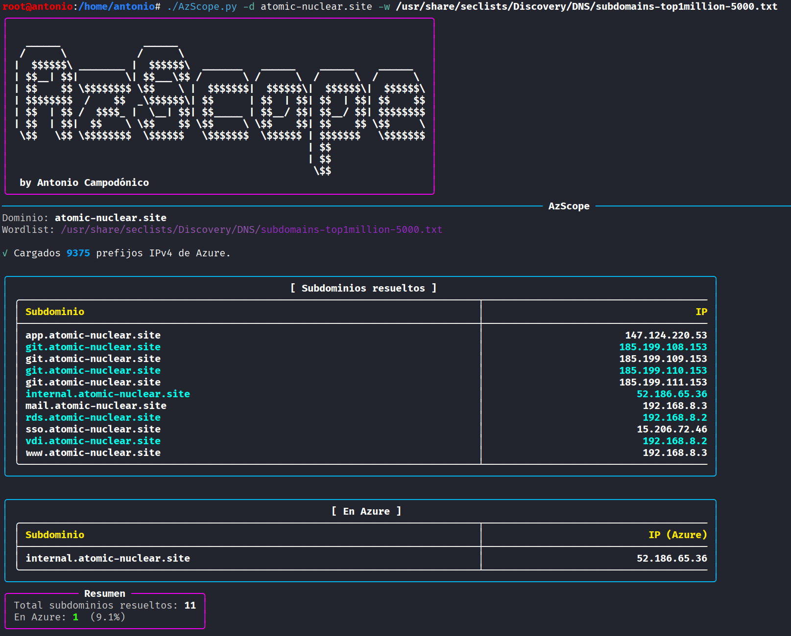
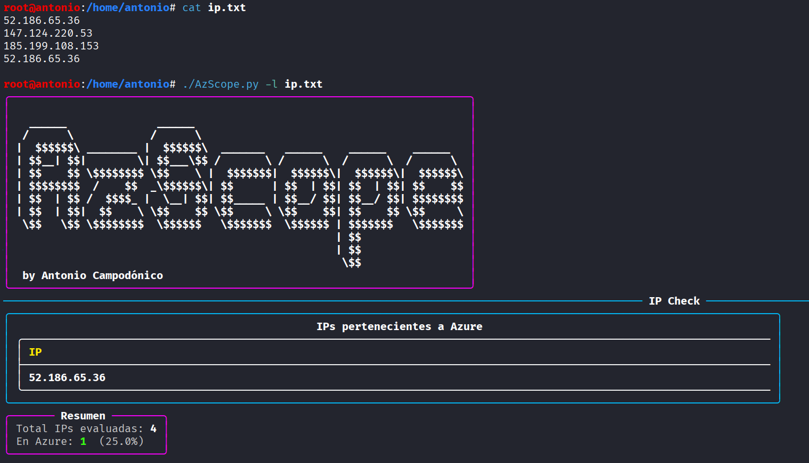

# AzScope.py

AzScope es una herramienta en Python para **enumerar subdominios alojados en Azure** y **verificar si direcciones IP pertenecen a Azure**, utilizando rangos oficiales de Microsoft.

---

## 🚀 Características

- **Enumeración de subdominios** en dominios objetivo usando wordlists.
- **Verificación de direcciones IP** contra rangos públicos de Azure.
- Opción para guardar resultados en formato **TSV**.
- Basado en rangos oficiales de Microsoft (ServiceTags).

---

## 📦 Requisitos

Instalar `dnsx` (de ProjectDiscovery) y la librería `rich`:

```bash
go install -v github.com/projectdiscovery/dnsx/cmd/dnsx@latest && pip install rich
```

> **Nota**: `dnsx` requiere tener instalado Go. En Debian/Ubuntu:
```bash
sudo apt install golang -y
```

---

## ⚙️ Instalación

1. Clonar este repositorio:
```bash
git clone https://github.com/<TU_USUARIO>/AzScope.git
cd AzScope
```

2. Dar permisos de ejecución:
```bash
chmod +x AzScope.py
```

---

## 📖 Uso

AzScope tiene **dos modos de ejecución**:

### 1️⃣ Enumerar subdominios en Azure
```bash
./AzScope.py -d <DOMINIO> -w <WORDLIST> [-o salida.tsv]
```
**Ejemplo:**
```bash
./AzScope.py -d microsoft.com -w /usr/share/seclists/Discovery/DNS/subdomains-top1million-5000.txt -o resultados.tsv
```

📌 **Salida esperada:**
- Lista de subdominios en Azure.
- Estadísticas finales.
- Exportación opcional en TSV.

## 📷 Ejemplos de salida

### 🔍 Enumeración de subdominios


---

### 2️⃣ Verificar IPs contra Azure
```bash
./AzScope.py -l <ARCHIVO_IPS> [-o salida.tsv]
```
**Ejemplo:**
```bash
./AzScope.py -l lista_ips.txt -o azure_ips.tsv
```

📌 **Salida esperada:**
- Lista de IPs que pertenecen a Azure.
- Porcentaje de coincidencias.
- Exportación opcional en TSV.

---
### 🌐 Verificación de IPs en Azure
<!-- Aquí colocarás la imagen de ejemplo -->


---


